<!-- README.md is generated from README.Rmd. Please edit that file -->

# retroPal 

<!-- badges: start -->

<!-- badges: end -->

For a good style, retroPal is your new friend when it comes to graph and
data visualization in R.

## Installation

You can install the development version of retroPal like so:

``` r
# install.packages("pak")
pak::pak("harrychown/retroPal")
# or
# install.packages("remotes")
remotes::install_github("harrychown/retroPal")
```

## Example

This is a basic example of the “brown” colourscheme

``` r
library(ggplot2)
library(retroPal)
ggplot(mtcars, aes(factor(carb), fill=factor(cyl))) + geom_bar() + scale_fill_manual(values = get_retro_pal("brown")[c(2,4,6)]) 
```

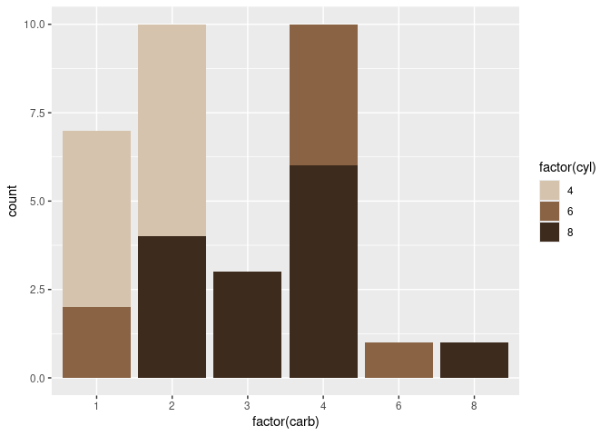

You can also use the in-built ggplot scales

``` r
library(ggplot2)
library(retroPal)
ggplot(mtcars, aes(factor(carb), fill=factor(cyl))) + geom_bar() + scale_fill_retro("mid4") 
```

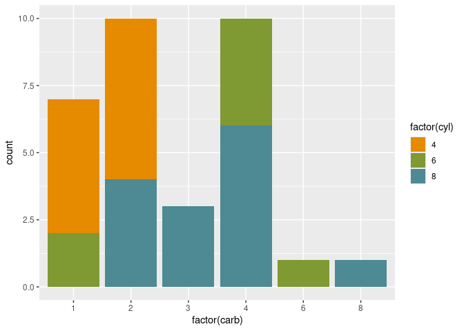

## Colour palettes

### Orange

``` r
library("hues")
swatch(get_retro_pal("orange"))
```

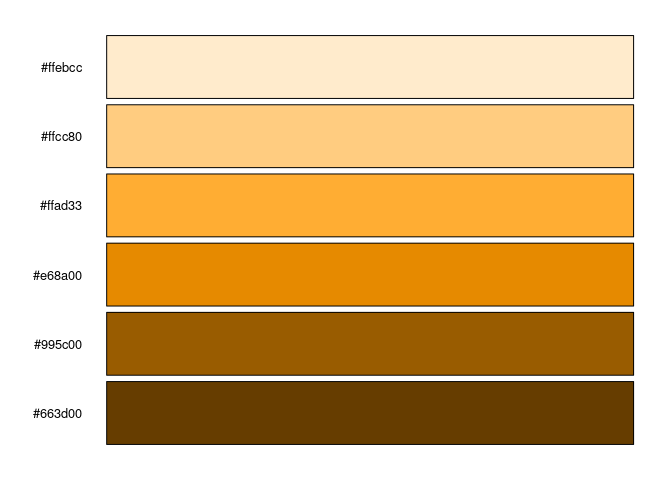

### Green

``` r
library("hues")
swatch(get_retro_pal("green"))
```

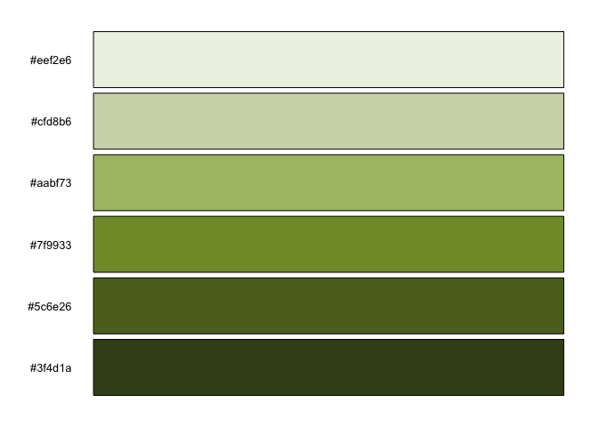

### Blue

``` r
library("hues")
swatch(get_retro_pal("blue"))
```

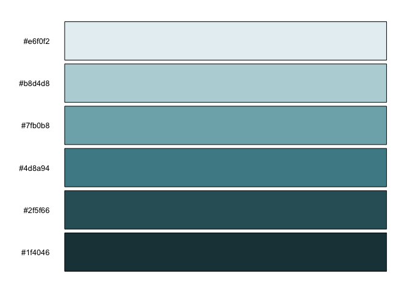

### Red

``` r
library("hues")
swatch(get_retro_pal("red"))
```

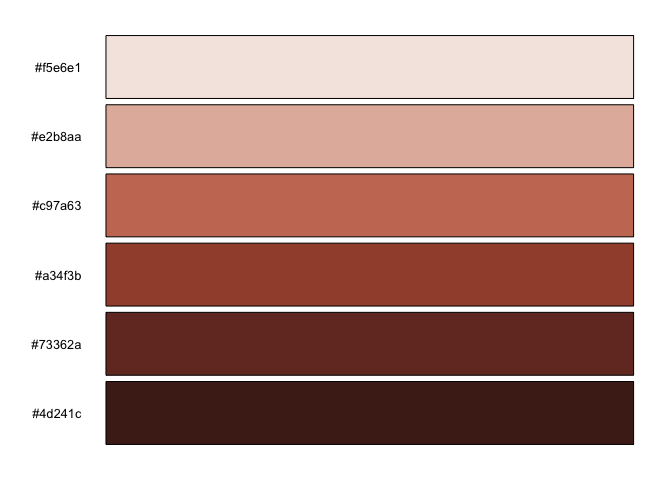

### Yellow

``` r
library("hues")
swatch(get_retro_pal("yellow"))
```

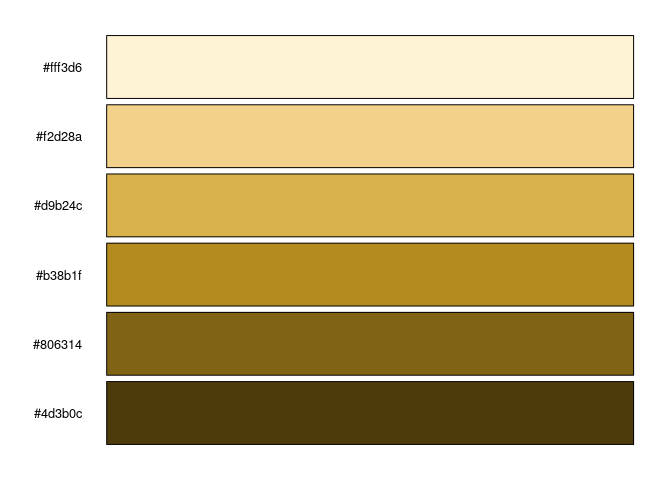

### Purple

``` r
library("hues")
swatch(get_retro_pal("purple"))
```

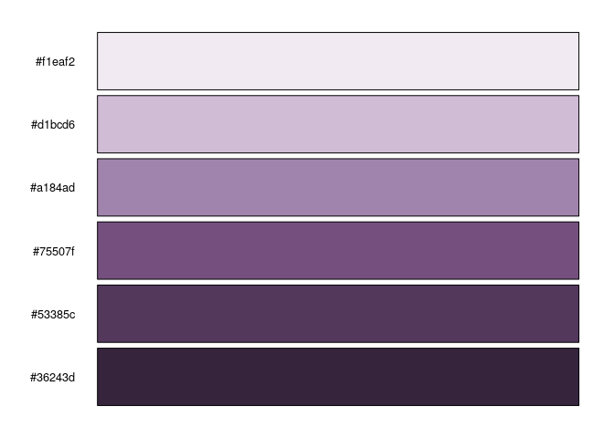

### Brown

``` r
library("hues")
swatch(get_retro_pal("brown"))
```

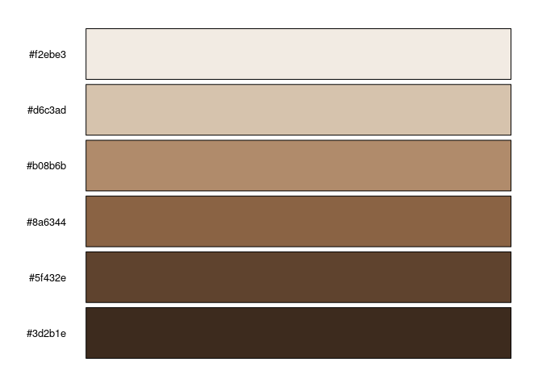

### Grey

``` r
library("hues")
swatch(get_retro_pal("grey"))
```

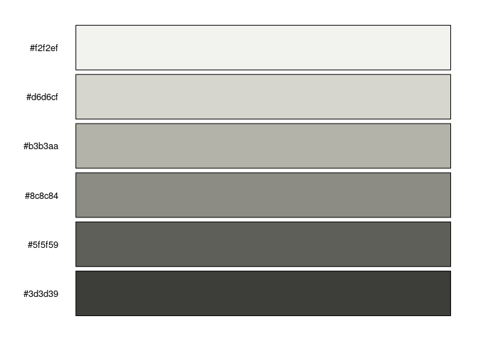

### Mid - 3

``` r
library("hues")
swatch(get_retro_pal("mid3"))
```

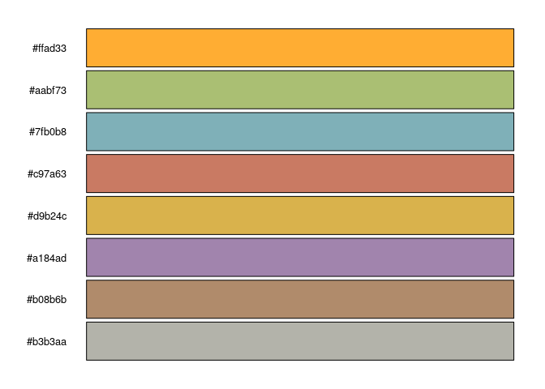

### Mid - 4

``` r
library("hues")
swatch(get_retro_pal("mid4"))
```

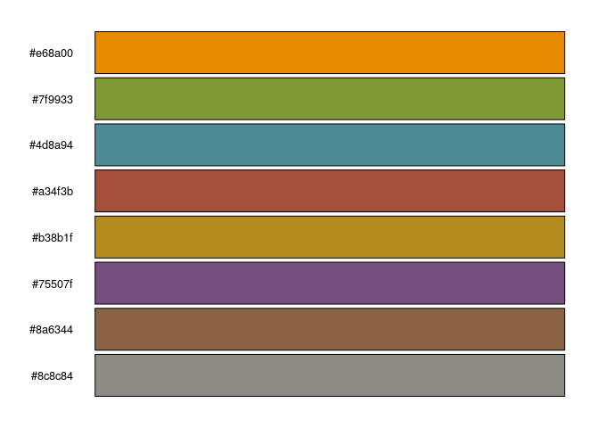

### Dark - 5

``` r
library("hues")
swatch(get_retro_pal("dark5"))
```

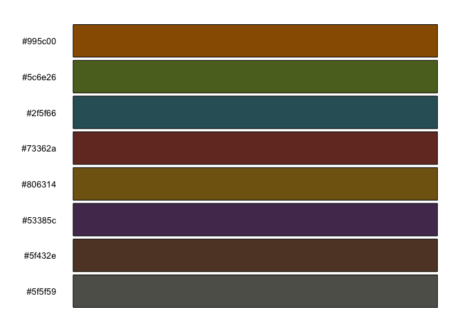

### Dark - 6

``` r
library("hues")
swatch(get_retro_pal("dark6"))
```


### Categorical

``` r
library("hues")
swatch(get_retro_pal("categorical"))
```

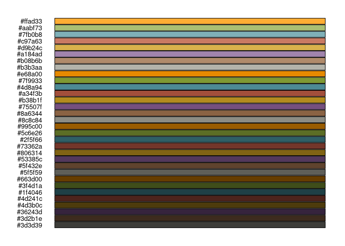
